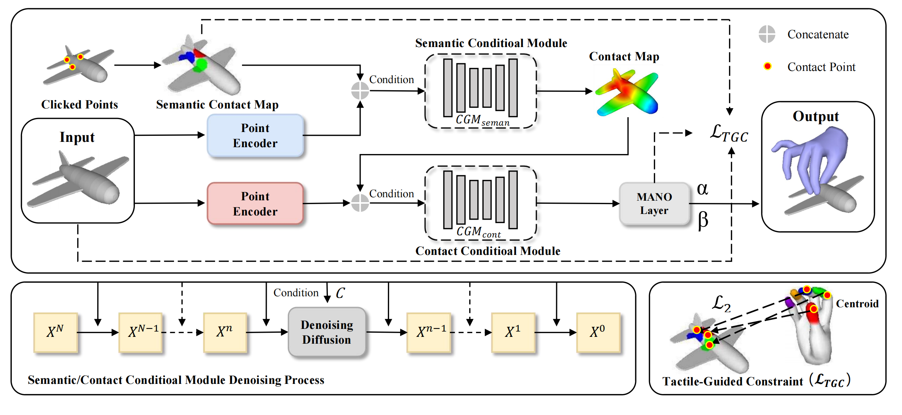
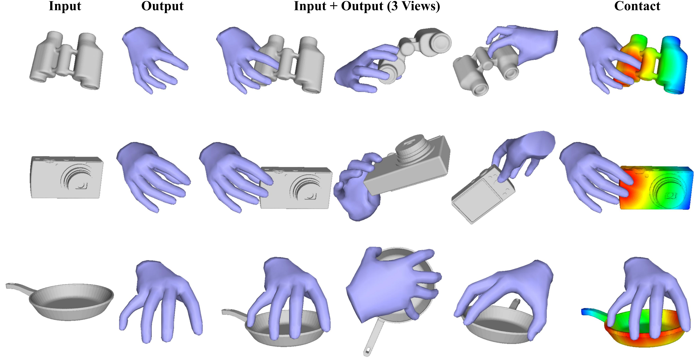
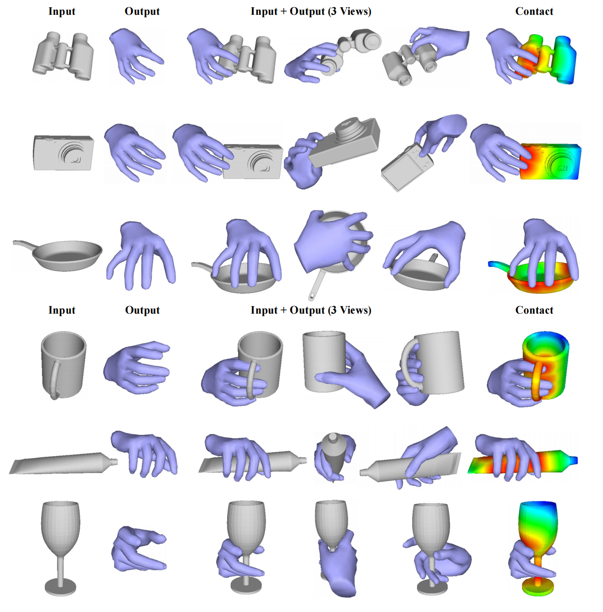

# ClickDiff

Official code for "ClickDiff: Click to Induce Semantic Contact Map for Controllable Grasp Generation with Diffusion Models"



## Download dataset

1. **GRAB** dataset from [https://grab.is.tue.mpg.de/](https://grab.is.tue.mpg.de/)
2. **ARCTIC** dataset from [https://arctic.is.tue.mpg.de/](https://arctic.is.tue.mpg.de/)


## RUN

Click [here](https://drive.google.com/drive/folders/1bnJjyJbSrf1978lCh80Zo8gaHdu8K_wp?usp=sharing) to download our weights and place them in the `checkpoint` directory.
Generate results on the test set and save them to `exp/demo`

```python
python eval.py
```




