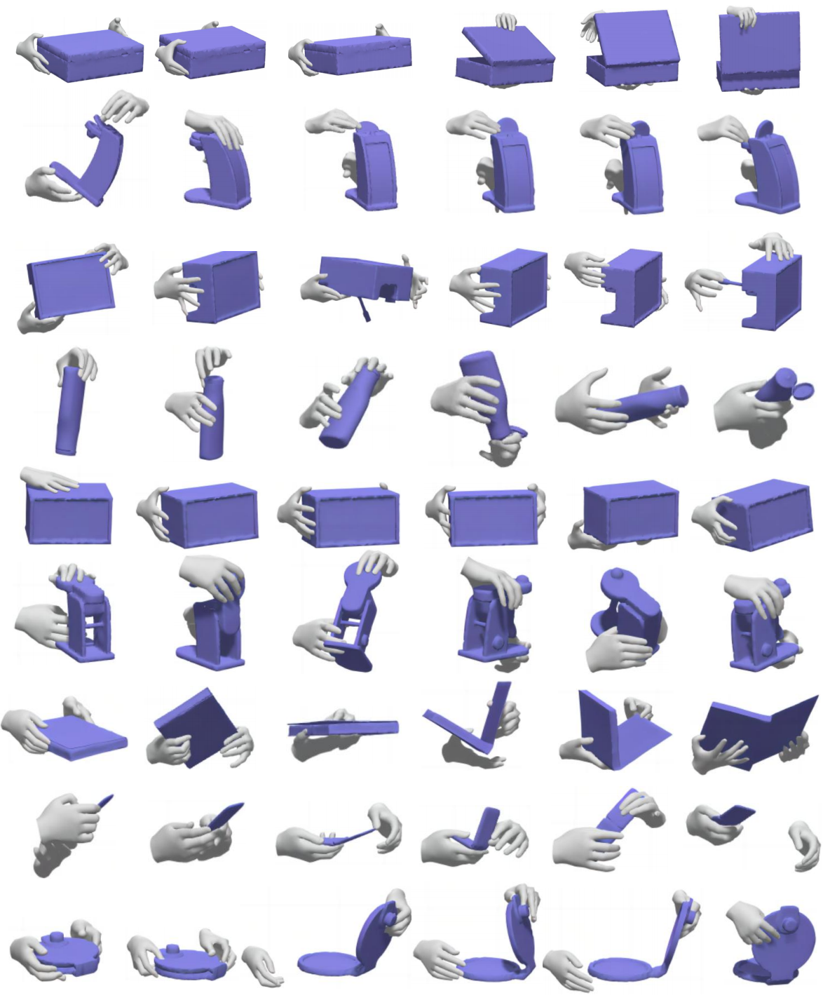

# ClickDiff
[](https://arxiv.org/abs/2407.19370) [](https://paperswithcode.com/sota/controllable-grasp-generation-on-grab?p=clickdiff-click-to-induce-semantic-contact)

Official code for "ClickDiff: Click to Induce Semantic Contact Map for Controllable Grasp Generation with Diffusion Models", ACM MM, Oral Paper, 2024.


## Download dataset

1. **GRAB** dataset from [https://grab.is.tue.mpg.de/](https://grab.is.tue.mpg.de/)
2. **ARCTIC** dataset from [https://arctic.is.tue.mpg.de/](https://arctic.is.tue.mpg.de/)


## RUN

Click [here](https://drive.google.com/drive/folders/1bnJjyJbSrf1978lCh80Zo8gaHdu8K_wp?usp=sharing) to download our weights and place them in the `checkpoint` directory.
Generate results on the test set and save them to `exp/demo`

```python
python eval.py
```




